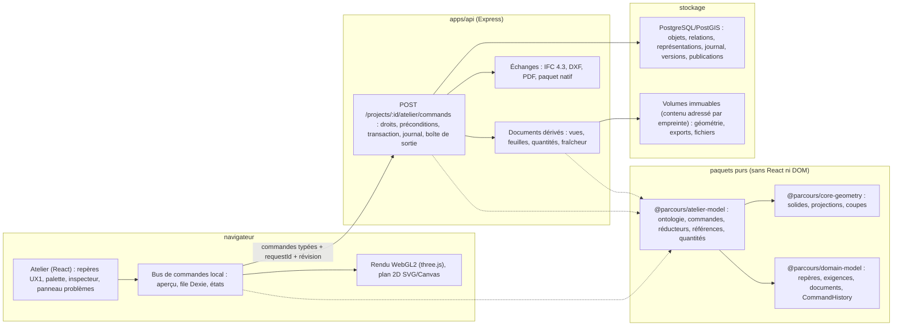
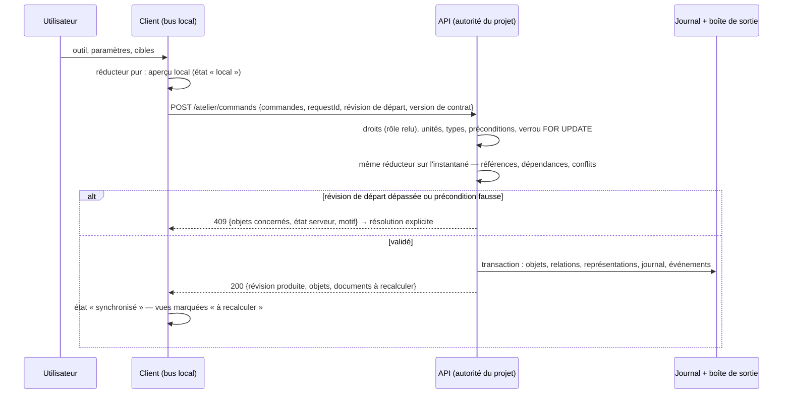

# Proposition — Atelier Architecture construit selon DrawAll V4.1

**Statut : proposition à valider, rien n'est encore implémenté.** Rédigée le 3 octobre 2026 à partir des trois
documents fournis — *DrawAll_v4.1_Architecture.md*, *DrawAll_v4.1_Concept.md*, *DrawAll_v4.1_Exigences_Sources.md* —
et de l'état de Fadi sur `main` (`ad61835`, CI verte). Elle ne modifie pas `docs/architecture.md` : si elle est
retenue, les amendements listés en section 10 y seront reportés avant la première ligne de code (règle AGENTS.md).

## 1. En bref

**Ce qui est proposé.** Reconstruire l'Atelier Architectural de Fadi comme la *lecture bâtiment* de DrawAll —
l'ontologie `building.architecture` (murs, portes, fenêtres, dalles, toitures, escaliers, pièces, zones) portée par
les contrats de l'Architecture V4 (identités définition / occurrence / représentation, commandes typées et
transactionnelles, références topologiques « à réparer », documents dérivés rattachés à une révision, versions
Git-like, travail local explicite) et par les décisions normatives D1–D6 — **à l'intérieur du monolithe modulaire
existant** (7 modules, Express + PostgreSQL/PostGIS, React/Vite, file hors-ligne Dexie, catalogue de documents,
scénario d'acceptation P.118). Fadi n'adopte pas le périmètre « universel » de DrawAll (mécanique, électricité,
tôlerie, FAO) : il adopte ses contrats et son ontologie bâtiment, et laisse les autres ontologies activables plus
tard sans changer le socle.

**Comment.** Par remplacement progressif (*strangler*) : le moteur extrait du prototype (`v14-viewer.js`,
`v14-tools.js`, `v8-toolbar.js`, ≈ 440 Ko de scripts non typés, encapsulés tels quels) reste la référence et le
repli pendant toute la transition ; le nouvel Atelier est construit à côté, sur le même projet et la même
révision, et prend la place lorsque le scénario d'acceptation (327 contrôles aujourd'hui) **et** les essais de
l'Architecture V4 §12 passent sur P.118. Les 21 étapes, les phases, les cartes mobiles et Harmonie dans les
étapes 10 / 11 ne bougent pas.

**Combien de temps (mon travail).** **20 à 25 journées de travail** pour les lots 0 à 8 (section 6), dont **11 à
12 journées** pour obtenir un premier Atelier basculable (modèle typé, commandes transactionnelles, interface
UX1–UX4, dessin 2D, objets d'architecture, vue 3D WebGL2). Le lot optionnel « noyau exact OCCT » demande 2 à 3
journées de plus et ne peut commencer qu'après votre arbitrage de licence (décision D.3, bloquante). Une journée
de travail = une session continue de ma part (6 à 8 h), livrée commitée sur `main` avec `typecheck`, tests,
build et scénario e2e verts. En calendrier, avec votre validation de chaque lot sur l'instance de démonstration
avant le suivant : **5 à 7 semaines**. L'hypothèse de l'estimation est détaillée en 6.2.

**Ce qui dépend de vous.** Cinq décisions ou fournitures externes (section 7) : licence OCCT (LGPL ou
commerciale, ou renoncer au noyau B-Rep pour l'architecture), hébergement durable et stockage objet, fournisseur
de modèle de langage pour l'assistant (sans lui, l'assistant reste déterministe), appareils et utilisateurs
réels pour les mesures T17 / T18, compte au service de validation IFC de buildingSMART.

## 2. Ce que demandent les trois documents, ramené à l'Atelier Architecture

### 2.1 Le périmètre retenu

| Document | Ce qu'il impose | Ce que Fadi en retient |
| --- | --- | --- |
| Concept V4 §1, §4 | « Un objet, deux lectures » : identités partagées, plusieurs représentations cohérentes, modification propagée aux documents | Un objet, **trois lectures** dans Fadi : modèle (Atelier), programme (Programmation, liaisons espaces programmés ↔ pièces dessinées déjà en place), documents (catalogue avec fraîcheur) |
| Concept V4 §5 (UX1–UX4) | Cinq repères permanents, trois niveaux d'affichage, palette de recherche, cycle sélection → paramètres → aperçu → contrôle → validation, aide située | Repris intégralement pour le nouvel Atelier (section 4.11) ; Harmonie occupe le panneau « modifications et problèmes » |
| Concept V4 §6 | 17 modules | M01, M02, M03, M04, M05 → module Atelier ; M11 → Documents (+ vues dans l'Atelier) ; M12 → Analyses métier ; M16 → Collaboration ; M17 → Projets et sources / Documents. M06–M10, M13–M15 hors périmètre (sauf l'API de commandes, commune) |
| Concept V4 §8, Architecture §7–§8 | Versionnement Git-like, états local / synchronisé / conflit / à recalculer / publié, périmètre hors connexion explicite | Microversion = `projects.model_revision` (existe) ; versions nommées, variantes, publication à construire (lot 5) ; file Dexie et joignabilité existantes, étendues aux commandes |
| Architecture §3 | Chaque module = paquet avec interface publique, types, migrations, permissions, événements, tests, manifeste | `packages/atelier-model` (pur, sans React ni DOM), manifeste de dépendances vérifié en CI (T14) |
| Architecture §4–§5 | Définition / occurrence / représentation, propriétés typées avec unités et provenance, relations porteuses de sens, références topologiques « à réparer », repères reliés par transformations explicites | Modèle typé (section 4.2–4.3) ; les trois repères de Fadi (`cadastral`, `geographic`, `local`) satisfont §5.3 et T04 tels quels |
| Architecture §6 | Cycle transactionnel : intention (commande, version du contrat, paramètres, cibles, identifiant de requête, révision de départ) → vérifications → résultat provisoire → conflits → transaction → événements → clients | API de commandes (section 4.4) à la place des écritures de domaines entiers (`floorDesign`) |
| Exigences V4, méthode | Une **fiche de capacité** par entrée DA avant développement ; états « à spécifier → spécifiée → prototype → vérifiée → disponible » | Fiches rédigées lot par lot dans `docs/atelier/fiches/`, gabarit en annexe A ; **aucune entrée n'est déclarée « disponible » sans sa preuve liée** — y compris les outils du moteur extrait, qui passent à l'état « prototype » |
| Exigences V4, T01–T20 | Vingt exigences transversales avec preuve minimale | Correspondance preuve par preuve en 5.2 |
| Annexe D (D1–D6) | Décisions normatives | Appliquées comme suit (2.2) |

### 2.2 Les décisions normatives D1–D6 appliquées à Fadi

| Décision | Application proposée |
| --- | --- |
| **D1 Noyau** — occt-wasm noyau de référence, vigilance LGPL, une seule géométrie canonique par objet | Pour l'ontologie bâtiment, la **géométrie canonique est paramétrique** (axe, épaisseur, hauteur, profil, relations hôte / ouverture) ; solides, maillages et symboles en sont dérivés par un moteur identifié et versionné (`packages/core-geometry` v1, déjà testé). OCCT n'entre pas dans la chaîne critique : il devient le moteur des **opérations de forme libres** (DA-04 : révolution, balayage, lissage, booléens, coques) dans un lot optionnel, après votre arbitrage de licence, derrière la même interface de moteur. Aucun objet n'a deux géométries canoniques. |
| **D2 Rendu** — WebGL2 par défaut, WebGPU activable avec repli, budget de trame p95 ≤ 16,7 ms | three.js (MIT), `WebGLRenderer` (WebGL2) par défaut ; `WebGPURenderer` derrière un réglage, repli automatique ; budget de trame mesuré par le scénario e2e (lignes `⏱`) sur le banc déclaré (exécuteur CI + bac à sable), puis sur votre appareil de référence et un téléphone Android. Aucune valeur promise avant mesure (Concept §11). |
| **D3 Collaboration** — CRDT pour texte et métadonnées légères, réservation / branches + fusion validée pour la géométrie, verrous logiques fins | Géométrie : réservation (existe, 30 min renouvelables) + variantes (lot 5) + fusion par rejeu validé des commandes ; verrous logiques pour les opérations structurelles (supprimer un niveau, changer un type utilisé). Texte d'annotation : Yjs (MIT) **seulement si** l'évaluation du lot 0 le justifie ; sinon les annotations restent des commandes. Pas de CRDT sur la géométrie. |
| **D4 Assistant** — boucle contrôlée, validation par moteurs déterministes, aperçu, accord explicite, 3 itérations max, journal des hypothèses, cache sémantique | L'infrastructure (séquence de commandes inspectable → exécution à blanc → aperçu → accord → exécution ; journal ; cache) est construite au lot 7 sur l'API de commandes. L'appel à un modèle de langage passe par un adaptateur ; **sans fournisseur configuré par vous, l'assistant propose depuis les règles déterministes de Fadi (Harmonie, contrôles métier)**. Règle déjà inscrite dans `docs/architecture.md` : aucune écriture d'origine IA hors des commandes réversibles. |
| **D5 Interopérabilité** — IFC 4.3 avec validation continue sans « certification », STEP AP242 Éd.3 en P2, fonctions de conception source maître, connecteurs objets-en-flux | IFC 4.3 (ISO 16739-1:2024) en export et import du sous-ensemble architecture, rapport de fidélité par échange (T13), validation en CI sur un corpus fixé ; **aucune mention de certification**. STEP : hors périmètre architecture (il viendrait avec le lot OCCT). Un objet importé n'a pas d'historique paramétrique inventé : il est « représentation seule » jusqu'à conversion explicite. |
| **D6 À mesurer** — WASM 32 bits et démarrage, mémoire GPU par onglet (LOD en exigence), maturité cadcore / CADara | Lot 0 : taille et temps d'initialisation des WASM candidats (OCCT, web-ifc) et budget de démarrage de l'Atelier sur P.118 ; streaming par niveau et instanciation prévus dès le lot 3 (le modèle est chargé niveau par niveau, les ouvertures sont instanciées) ; cadcore et CADara ne sont ni utilisés ni cités dans le produit. |

### 2.3 Hors périmètre, explicitement

Structure (M06, hors le poteau que le prototype dessine déjà), bois, tôlerie, mécanique, réseaux, électricité,
électronique, FAO, simulation physique, DWG/DGN natifs (SDK commerciaux), solveur de contraintes général
(D-Cubed ou équivalent : décision ouverte D.3 ; Fadi ne porte qu'un petit jeu de contraintes 2D d'esquisse,
borné et documenté), rendu photoréaliste. L'ontologie reste activable par projet : ajouter plus tard
`building.structure` complet ne touche ni le socle, ni l'API de commandes.

## 3. Ce que Fadi a déjà, ce qui change

| Contrat DrawAll | Aujourd'hui dans Fadi (`ad61835`) | Décision | Lot |
| --- | --- | --- | --- |
| Identités stables, définition / occurrence / représentation | Objets natifs `design.v13` (`walls`, `columns`, `doors`, `windows`, `stairs`, `paths`, `dims`, `texts`, `rooms` par niveau), projetés en `levels` / `architectural_objects` (identifiants préfixés projet, relation `hosted-by`) | **Remplacer** le format du moteur par le modèle typé ; **garder** la règle d'identifiants préfixés et la conversion sans perte vers / depuis `design.v13` (tests aller-retour sur P.118) tant que le moteur classique sert de repli | 1 |
| Propriétés typées, unités, provenance, statut | Propriétés brutes du moteur (`frame: "local"` posé par la projection) ; `Exigence` / `Hypothèse` / `Recommandation` distinctes ; trois repères typés | **Adapter** : chaque propriété porte valeur, unité, provenance, statut ; refus serveur d'une grandeur incompatible (T03) | 1–2 |
| Commandes typées, transactionnelles, idempotentes | Écriture de domaines entiers (`floorDesign`, clé par clé, révision par clé, 409, `FOR UPDATE`) ; `CommandHistory` générique testé dans `domain-model` ; annuler / rétablir dans le moteur, persistés | **Remplacer** par `POST …/atelier/commands` (lot de commandes, `requestId`, révision de départ, version de contrat) ; **garder** le verrou de ligne, la révision du projet et le 409 explicite | 2 |
| Journal, événements, documents « à recalculer » | `projects.model_revision` ; `documentFreshness(current, produced)` ; exports de dessins au catalogue avec révision et empreinte native | **Garder** la fraîcheur ; **ajouter** le journal des commandes et une boîte de sortie transactionnelle (événements versionnés, idempotents) | 2 |
| Références topologiques « à réparer » | Aucune (les cotations du moteur sont des traits libres) | **Ajouter** (résolveur, état, propositions, jamais de rattachement silencieux) | 1, 4 |
| Travail local, états visibles | File Dexie des écritures de l'Atelier, états « local / synchronisation / serveur / conflit / échec », joignabilité distincte du réseau, sonde `/health`, sauvegarde de conflit | **Garder** et **adapter** à la granularité des commandes ; **ajouter** l'état « à recalculer » et « publié », le périmètre local explicite (ce qui est exécutable hors connexion), la surveillance des quotas | 2, 5 |
| Collaboration | Rôles serveur (`lecteur` / `editeur` / propriétaire), réservation expirante, notifications, commentaires, conflits résolus explicitement | **Garder** ; **ajouter** verrous logiques fins, variantes, fusion validée | 5 |
| Versions nommées, branches, publication | Copies de projet, archive JSON, révision courante | **Ajouter** versions nommées immuables, variantes (fork du journal), publication figée | 5 |
| Rendu 3D | Canvas 2D du prototype (`v14-viewer.js`), volume / éclaté / plan / coupes / façades | **Remplacer** par WebGL2 (three.js) pour le 3D ; **garder** le SVG / Canvas 2D pour le plan et les vues techniques dérivées, réécrits en TypeScript depuis `core-geometry` | 3, 4 |
| Documents dérivés | Plan de lecture SVG et tableau des surfaces à la révision courante ; exports DXF / SVG / PNG / CSV / JSON du moteur enregistrés avec révision ; aperçu conceptuel (axonométrie) | **Garder** le catalogue ; **remplacer** la production par des vues dérivées du modèle typé (plans, coupes, façades, feuilles, nomenclatures, quantités) avec références d'objets et révision | 4 |
| Échanges | Archive JSON (paquet natif de fait), DXF / SVG / PNG / CSV en export, parcelle JSON / KML / KMZ, repères et CRS de la parcelle | **Ajouter** IFC 4.3 export / import avec rapport de fidélité, PDF des feuilles, manifeste du paquet natif versionné ; DXF import 2D de base | 6 |
| Assistant, scripts | Règles Harmonie et contrôles métier côté serveur ; aucune API de script | **Ajouter** API de script = mêmes commandes (T19), boucle contrôlée | 7 |
| Interface | Barre d'outils V8, panneaux du moteur, mode immersif étapes 10 / 11, cartes mobiles, puce « outil actif » | **Remplacer** par les cinq repères UX1 et la palette UX2 ; **garder** le mode immersif, les cartes, Harmonie dans l'étape | 3 |
| Sauvegarde / restauration | `pg_dump` quotidien, restauration vérifiée en CI, `/health` | **Garder** ; le journal et les volumes entrent dans la vérification de restauration (T11) | 2, 8 |

## 4. Architecture cible, dans le monolithe modulaire

### 4.1 Paquets et modules

- `packages/atelier-model` est **le même code** exécuté dans le navigateur (aperçu immédiat) et sur le serveur
  (validation faisant autorité) — c'est la règle de `docs/architecture.md` (« la même logique métier versionnée des
  deux côtés ») appliquée au cycle §6 de l'Architecture V4 : « une opération peut disposer d'un aperçu local puis
  d'une validation serveur ; la différence entre aperçu et résultat validé reste visible ».
- Manifeste de module (`packages/atelier-model/manifest.json` : nom, version, versions de contrat de commandes,
  dépendances autorisées) et script CI `scripts/check-module-deps.mjs` qui refuse tout import d'un module Fadi
  vers les internes d'un autre (T14). Pas de dépendance circulaire : `atelier-model` ne connaît ni l'API ni React.
- Les calculs lourds (vues dérivées d'un grand modèle, export IFC, booléens OCCT le cas échéant) tournent dans un
  Web Worker côté navigateur et dans un travail serveur à révision d'entrée explicite ; un résultat terminé
  tardivement reste rattaché à sa révision et n'écrase jamais l'état récent (§6, essai « calcul ancien »).

### 4.2 Modèle d'information

Tables PostgreSQL typées, propriété du module Atelier (`apps/api/src/db/schema.ts`, `init.sql` idempotent) :

| Entité (Architecture §4) | Table | Contenu |
| --- | --- | --- |
| Définition | `atelier_definitions` | Type réutilisable : type de mur (composition, épaisseur, matériau), type de porte / fenêtre (dimensions, sens), type de dalle, de toiture, d'escalier ; version du catalogue d'origine (T15) |
| Occurrence | `atelier_objects` | Objet placé : identifiant stable, classe d'ontologie, niveau (étage DA-05-04, distinct des calques CAO DA-05-01 / 03), définition, paramètres de placement, calque, groupe, phase ; `model_revision` de dernière modification |
| Propriété typée | `atelier_properties` | `{objet, nom, valeur, unité, provenance (saisie / import / calcul / règle), statut (déclarée / vérifiée / à vérifier)}` ; propriétés BIM et classification (DA-06-07 / 08) |
| Relation | `atelier_relations` | `hosted-by` (porte / fenêtre / ouverture → mur ou dalle), `bounded-by` (pièce → murs), `connects` (escalier → deux niveaux), `contains` (zone → pièces / espaces), `references` (cotation / annotation → caractéristique d'objet), `programme` (pièce → espace programmé, liaison existante), chacune avec ses conditions de validité |
| Représentation | `atelier_representations` | `{objet, usage (plan-2d, solid-3d, brep, symbole), autorité (paramétrique / dérivée / importée), moteur + version, empreinte des entrées, volume}` ; une seule représentation faisant autorité par objet |
| Document dérivé | `produced_documents` (existe) + `atelier_views`, `atelier_sheets` | Vue, feuille, annotation, nomenclature : objets référencés, révision, fraîcheur |
| Résultat | `calculated_results` (type existant) | Quantités, contrôles : méthode, entrées, moteur, révision |
| Publication | `atelier_publications` | Ensemble figé : révision, versions de catalogues, documents, auteur, date |
| Journal | `atelier_commands` | Commande validée : `requestId` (unique par projet), version de contrat, paramètres, objets ciblés, révision de départ, révision produite, inverse, auteur, date |
| Boîte de sortie | `atelier_outbox` | Événements versionnés à traiter de façon idempotente (documents à marquer, projections, notifications) |

Ontologie `building.architecture` déclarée dans `packages/atelier-model/src/ontology/` : classes, propriétés
obligatoires et unités, relations admises, classe IFC 4.3 correspondante (`IfcWall`, `IfcDoor`, `IfcWindow`,
`IfcOpeningElement`, `IfcSlab`, `IfcRoof`, `IfcStair`, `IfcSpace`, `IfcZone`, `IfcBuildingStorey`). Le poteau du
prototype est déclaré dans `building.structure` (seule classe activée de cette ontologie, pour ne pas perdre
l'outil existant ni mentir sur sa nature). Les classes manquantes du prototype — dalle, toiture, ouverture libre,
espace, zone — sont ajoutées ; les tracés, cotations et textes du moteur deviennent des objets d'esquisse (M01) et
d'annotation (M11), pas des objets d'architecture.

**Migration des données.** La conversion `design.v13` ↔ modèle typé est une fonction pure testée **aller-retour
sur P.118** (JSON identique après v13 → typé → v13, sans arrondi — règle AGENTS.md) ; elle sert à migrer les
projets existants une fois (idempotent, vérifié par `scripts/verify-restore.sh`) et à faire lire / écrire le moteur
classique pendant la transition. Un objet converti depuis le prototype reçoit une **fonction de conception réelle**
(ses paramètres existent dans les données : axe, épaisseur, hauteur), jamais inventée.

### 4.3 Géométrie, représentations et références

- **Canonique = paramétrique.** Un mur est son axe, son épaisseur, sa hauteur, son type et ses ouvertures
  hébergées ; une dalle est son contour et son épaisseur ; un escalier droit ses niveaux, sa largeur, son nombre de
  contremarches (fiche DA-07-10 de l'Exigences V4, reprise telle quelle). Solide 3D, symbole de plan et maillage
  d'affichage sont **dérivés** par `core-geometry` (moteur `fadi-geometry` versionné, aujourd'hui `V14Geometry`
  porté et testé), avec clé de calcul = entrées + version du moteur (§5.3).
- **Précision.** Grandeurs typées en mètres, tolérances déclarées par opération (jonction de murs, détection de
  pièce fermée), affichage en unités d'affichage sans altérer la valeur. Les trois repères de Fadi restent tagués ;
  le rendu utilise une origine locale proche de la zone visible sans modifier l'implantation (§5.3).
- **Références topologiques (§5.2, T05).** Une cotation, une contrainte ou une ouverture référence une
  *caractéristique nommée* d'un objet paramétrique (`mur:face-gauche`, `mur:arête-début`, `dalle:contour[2]`),
  stable tant que l'objet existe. Une scission de mur, une suppression ou un changement de type qui rend la
  référence incertaine la fait passer à l'état **« référence à réparer »**, avec les correspondances proposées,
  listées dans le panneau des problèmes ; le système ne déplace jamais silencieusement une référence vers une
  face voisine.
- **Opérations de forme (DA-04).** Extrusion d'esquisse et pousser / tirer (hauteurs, épaisseurs) au lot 3 sur
  solides paramétriques. Révolution, balayage, lissage, booléens, trous, coques : lot optionnel OCCT (WASM dans un
  Web Worker, représentation `brep`, moteur `occt@version`) ; alternative permissive à mesurer au lot 0 pour les
  booléens de maillage (manifold-3d, Apache-2.0) — un maillage n'est pas une B-Rep, la fiche de capacité le dira.

### 4.4 Cycle transactionnel d'une commande

- **Idempotence (T06).** `requestId` unique par projet : une requête répétée après coupure renvoie le résultat
  déjà validé, jamais une seconde modification. Test API dédié.
- **Annuler / rétablir.** L'inverse d'une commande est une nouvelle commande (nouvelle microversion) ; l'historique
  n'est jamais réécrit. En collaboration, annuler ne touche que ses propres commandes et signale celles d'autrui
  qui en dépendent (UX3, §7 « Annulation »).
- **Dépendances (T07).** Chaque commande validée émet les événements qui marquent les vues, feuilles, quantités et
  le bilan Harmonie « à recalculer » ; un document périmé ne peut pas être présenté comme actuel (fraîcheur déjà
  en place, étendue aux objets référencés).
- **Lot de commandes.** Un geste métier qui touche plusieurs objets (déplacer un escalier et sa trémie, scinder
  un mur et réaffecter ses ouvertures) est un seul lot, validé et annulé comme une action (règle existante
  « Coherent, reversible operations »).

### 4.5 Rendu

three.js, WebGL2 par défaut (D2) ; scène par niveau (chargement et déchargement par niveau = streaming LOD de
D6-b), instanciation des ouvertures et poteaux, sélection par lancer de rayon, plans de coupe (vue coupe,
DA-14-04), modes volume / éclaté / coupe conservés avec leurs comportements. WebGPU activable dans Paramètres,
repli automatique à la perte de contexte ou à l'absence de l'API. Le plan 2D (dessin et vues techniques) reste
en SVG / Canvas 2D : c'est la représentation de travail de l'architecte et celle des documents. Mesures
(T18) : temps d'ouverture, sélection, déplacement d'un élément, navigation 3D, enregistrement — imprimées par le
scénario, puis prises sur vos appareils avant tout seuil (`docs/architecture.md`, « Acceptance target »).

### 4.6 Travail local, synchronisation, états

- La file Dexie existante porte des **commandes** (et non plus des domaines) ; le réducteur local donne l'aperçu
  immédiat ; au retour du réseau, chaque commande est réexaminée par l'API avec les droits et la révision actuels
  (§8) ; une commande incompatible reste un **brouillon à traiter**, visible, jamais déclarée synchronisée.
- **Périmètre local explicite (T09).** L'Atelier affiche ce qui est exécutable hors connexion (toutes les
  commandes du réducteur) et ce qui ne l'est pas (export IFC, PDF, contrôles lourds, variantes) avec le motif.
- États par objet et par commande : **local, synchronisé, conflit, à recalculer, publié** (Concept §8), dans
  l'en-tête de projet et le panneau des problèmes.
- Quotas : `navigator.storage.estimate()` surveillé, avertissement dans Paramètres (« données conservées par le
  navigateur », existant), procédure de récupération documentée (§8).

### 4.7 Versions, variantes, publication, collaboration

- **Microversion** : chaque lot de commandes validé (`projects.model_revision`, existant).
- **Version nommée** : instantané immuable d'une révision (nom, auteur, date, empreinte), consultable et
  comparable (objets ajoutés / modifiés / supprimés, documents).
- **Variante** (branche) : fork du journal à partir d'une révision ; travail isolé ; **fusion** = rejeu validé des
  commandes de la variante sur le tronc, avec la liste des objets affectés et la mise en évidence 3D des
  différences ; tout conflit est explicite, aucune fusion automatique silencieuse (D3, §7).
- **Publication** : ensemble figé (révision, versions de catalogues, documents) ; la conception continue à côté
  (*release management* non bloquant) ; une publication est restaurable avec ses dépendances (T11, T12).
- **Verrous logiques fins** pour les opérations structurelles ; réservation expirante conservée ; rôles serveur
  conservés (T10) ; conflits toujours résolus explicitement (existant).

### 4.8 Documents dérivés et quantités (M11)

Vues générées depuis le modèle typé à une révision : plans par niveau (hauteur de coupe réglable), coupes
(plan vertical quelconque), façades (projection avec gestion de visibilité par tri des faces — équivalent
borné de DA-01-12 / DA-14-19, pas un moteur de lignes cachées général), plan de masse avec parcelle (repères
convertis explicitement), détails et fenêtres à l'échelle. Chaque vue garde ses objets référencés, sa révision et
son état de fraîcheur, visibles (recette B.15). Annotations attachées par références (cotations, textes,
étiquettes, repères d'objets), cartouches et cadres, feuilles et jeux de feuilles, tableaux (pièces, portes,
fenêtres, murs), quantités et rapports reproductibles depuis une révision (recette B.17). Exports SVG, DXF, PDF,
CSV, enregistrés au catalogue avec révision et empreinte (mécanisme existant).

### 4.9 Échanges

| Format | Rôle | Bibliothèque pressentie (licence) | Limite annoncée |
| --- | --- | --- | --- |
| IFC 4.3 (ISO 16739-1:2024) | Export et import du sous-ensemble architecture, `IfcMapConversion` depuis le CRS de la parcelle (DA-22-06) | web-ifc (MPL-2.0 ; prise en charge du schéma 4.3 à vérifier au lot 0) ou écriture directe du fichier depuis `atelier-model` (sous-ensemble petit et spécifié) ; validation en CI avec IfcOpenShell en outil de test (LGPL, non lié au produit) | Conformité **testée** sur un corpus, jamais « certifiée » (D5) ; pas de paramétricité portée par IFC |
| DXF | Export des vues (existant) ; import 2D de base comme références de construction | Écriture existante ; lecture ASCII simple | Pas de DWG (SDK commercial ODA, hors dépôt) |
| PDF | Feuilles et jeux de feuilles (DA-22-05) | pdf-lib ou jsPDF (MIT), rendu depuis le SVG des vues | Pas d'outils PDF d'édition (DA-22-04 limité à la sortie et aux pièces jointes) |
| Paquet natif | Archive JSON existante + manifeste versionné (schémas, unités, repères, identités, versions de catalogues) | — | Politique de migration documentée à chaque changement de schéma (T15) |

Chaque transfert produit un **rapport** : objets conservés, transformés, omis, à réparer (T13) ; la matrice
d'échanges (`docs/atelier/matrice-echanges.md`) distingue lecture, édition, réexport et fidélité par type d'objet.

### 4.10 Automatisation et assistant à boucle contrôlée (D4, T19)

API de script = l'API de commandes, avec permissions et versions explicites. Boucle : séquence de commandes
inspectable → **exécution à blanc** (le réducteur valide sans transaction) → aperçu des objets affectés et des
documents à recalculer → accord explicite → exécution ; auto-correction bornée à trois itérations ; journal des
hypothèses attaché à la proposition ; cache des séquences validées (clé = intention normalisée + révision des
règles). Le générateur est un adaptateur : règles déterministes de Fadi par défaut, modèle de langage si vous
fournissez un fournisseur et une clé (jamais commitée).

### 4.11 Interface (UX1–UX4)

- **Cinq repères permanents** : navigateur du projet (niveaux, calques, objets, documents), zone de travail
  (plan 2D / 3D, bascule), commandes (barre et palette), inspecteur (propriétés typées avec unités, erreurs
  « objet, cause, action »), panneau des modifications et problèmes (journal, états de synchronisation,
  références à réparer, conflits, documents à recalculer, **réserves Harmonie**).
- **Trois niveaux d'affichage** : Essentiel (les outils du prototype, l'initiation), Contextuel (propositions
  selon la sélection, favoris stables), Complet (dépendances, journal, diagnostic, automatisation).
- **Palette (UX2)** : outils, objets, paramètres, aides ; synonymes et termes d'autres logiciels (« Push/Pull »,
  « Offset », « Décaler », « Trim ») ; chaque résultat dit l'action, les conditions et un exemple court.
- **Cycle (UX3)** : sélection → paramètres → aperçu → contrôle → validation ; accrochages, contraintes et objets
  affectés visibles ; un aperçu simplifié ne vaut pas validation.
- **Aide située (UX4)** : exemple court et paramètre expliqué par commande ; familles Créer / Modifier / Connecter /
  Analyser / Documenter / Partager.
- **Téléphone et tablette** : pointeur / toucher unifiés, cartes mobiles et mode immersif des étapes 10 / 11
  conservés, puce d'outil actif conservée ; clavier pour les tâches définies (T16), axe-core en CI (existant).

### 4.12 Sécurité et droits

Inchangés : rôle relu par le serveur à chaque requête (`read` / `comment` / `write` / `owner`), 404 sans accès,
mutations uniquement par l'autorité du projet (T10) ; les scripts et l'assistant héritent des droits de
l'utilisateur, sans accès direct aux tables (§3 « Extensions »).

## 5. Couverture des exigences

### 5.1 Entrées DA retenues (toutes à l'état « à spécifier » jusqu'à leur fiche)

| Catégorie (annexe B) | Entrées retenues | Lot | Précisions |
| --- | --- | --- | --- |
| B.2 Dessin et esquisse (DA-01) | 12 / 12 | 3 (01–11), 4 (12) | Esquisse contrainte limitée : coïncidence, parallélisme, perpendicularité, distance, horizontal / vertical |
| B.3 Édition et transformation (DA-02) | 17 / 17 | 3 | Toutes comme commandes réversibles ; saisie de précision (16) et manipulateur (17) en équivalents fonctionnels |
| B.4 Méthodes 3D (DA-03) | 6 / 16 | 3 (09, 10, 13, 15), 3 + optionnel (01, 12) | Solide général et multicorps complets seulement avec le lot OCCT |
| B.5 Opérations de forme (DA-04) | 9 / 11 | 3 (01, 07), optionnel (02, 03, 04, 08, 09, 10, 11) | 05, 06 hors périmètre |
| B.6 Organisation et contenu réutilisable (DA-05) | 12 / 18 | 1, 3, 5 | Calques, classes, niveaux CAO, étages, groupes, blocs, bibliothèques de blocs, composants, références externes (version nommée d'un autre projet en fond), objets, bibliothèques de types (14 / 15 = catalogue de portes / fenêtres / murs versionné) |
| B.7 Paramètres et configurations (DA-06) | 4 / 10 | 1, 3 | 01, 02 (jeu borné), 07, 08 |
| B.8 Éléments d'architecture (DA-07) | 13 / 23 | 3 (01–07, 15, 16, 17), 3–4 (10 escalier droit, 12 garde-corps simple, 22 phases) | Terrain (18, 19) : partiel via l'outil Parcelle existant (altimétrie), pas de maillage de terrain ; 08, 09, 11, 13, 14, 20, 21, 23 hors périmètre |
| B.15 Vues et documentation (DA-14) | 18 / 22 | 4 | 07 limité aux détails d'assemblage d'escalier ; 11, 13, 14, 15 hors périmètre |
| B.16 Mesure et annotation (DA-15) | 8 / 19 | 4 | 01, 02, 04, 05, 06, 07, 17 (repères d'objets), 19 |
| B.17 Feuilles, quantités, rapports (DA-16) | 15 / 17 | 4 | 09, 16 hors périmètre |
| B.18 Analyse et contrôle (DA-17) | 3 / 16 | 3 (16), 5 (13 collisions architecture, 15 règles → contrôles métier existants) | Pas de simulation |
| B.19 Visualisation (DA-18) | 4 / 4 | 3 (03, 04), 4 (01 rendu simple, 02 étude solaire conservée) | Pas de rendu photoréaliste |
| B.20 Automatisation (DA-19) | 3 / 7 | 4 (06), 7 (01, 02) | 03, 04, 05, 07 hors périmètre |
| B.22 Collaboration et données (DA-21) | 9 / 9 | 2, 5 | 03 limité architecture ↔ programme ; 08 comparaison de vues entre révisions |
| B.23 Interopérabilité (DA-22) | 5 / 10 | 6 | 01, 03 (DXF), 04 (limité), 05, 06 ; 02, 07–10 hors périmètre |
| **Total** | **138 / 324** | | Les 186 autres relèvent des ontologies non activées ou de domaines hors architecture |

### 5.2 Exigences transversales T01–T20 — preuve prévue

| Exigence | Preuve dans Fadi | Lot |
| --- | --- | --- |
| T01 Produit unique | Même compte, même projet, Atelier + Programmation + Documents (existant) ; ontologies activables | — |
| T02 Identités et représentations liées | Test : modifier un mur → retrouver ses représentations, ouvertures, vues, nomenclatures | 1, 4 |
| T03 Unités et propriétés typées | Test API : grandeur incompatible refusée (400 avec motif), conversions d'affichage | 2 |
| T04 Tolérances et géoréférencement | Tests existants des repères + export IFC avec `IfcMapConversion` comparé au CRS de la parcelle | 6 |
| T05 Références topologiques | Test : scission d'un mur porteur d'une cotation → « à réparer » avec propositions | 1, 4 |
| T06 Transactions et idempotence | Test API : même `requestId` deux fois → une seule modification, même réponse | 2 |
| T07 Dépendances et résultats périmés | Test : commande → vues / quantités / bilan marqués, document périmé non présentable comme actuel | 2, 4 |
| T08 Conflits et annulation collaborative | Scénario : deux navigateurs, modifications incompatibles → 409 explicite ; annulation limitée à ses commandes | 2, 5 |
| T09 Disponibilité locale | Scénario : hors ligne, commandes exécutables affichées, reprise contrôlée, brouillon incompatible visible | 2 |
| T10 Droits | Tests existants (404 / 403 / 423) étendus aux commandes et scripts | 2, 7 |
| T11 Sauvegarde et restauration | `scripts/verify-restore.sh` étendu au journal, volumes, versions, publications | 2, 8 |
| T12 Historique et publication | Test : publication → révisions et versions de catalogues exactes retrouvées | 5 |
| T13 Fidélité des échanges | Test : export IFC → réimport → rapport des écarts ; matrice d'échanges publiée | 6 |
| T14 Modularité | `scripts/check-module-deps.mjs` en CI, manifeste | 1 |
| T15 Migrations et catalogues | Migration de P.118 et des projets de la base de test ; versions de catalogue figées par publication | 1, 5 |
| T16 Interface stable et accessible | Scénario clavier des tâches définies, axe-core, repères et favoris persistants | 3 |
| T17 Apprentissage mesuré | **Protocole fourni, mesure par vous** avec des utilisateurs réels (hors de ma portée) | 8 |
| T18 Performance et diagnostic | Lignes `⏱` du scénario sur le banc déclaré ; vos appareils pour les seuils | 3, 8 |
| T19 Scripts et IA contrôlés | Tests : script → mêmes commandes, mêmes refus ; boucle bornée à 3 itérations | 7 |
| T20 Validation des analyses | Sans objet (pas de simulation) ; contrôles métier existants restent tracés (source, version, résultat) | — |

### 5.3 Essais de l'Architecture V4 §12

| Essai | Où il est prouvé |
| --- | --- |
| Modification de topologie | Test `atelier-model` (références conservées ou « à réparer ») |
| Requête répétée | Test API idempotence |
| Deux modifications incompatibles | Scénario deux navigateurs (existe pour les formulaires, étendu aux commandes) |
| Calcul ancien terminé tardivement | Test : vue produite pour la révision n livrée après n+1 → rattachée à n, marquée périmée |
| Export et réimport | Test IFC aller-retour avec rapport |
| Interruption réseau | Scénario hors ligne (existe, étendu aux commandes et au périmètre local) |
| Publication | Test des dépendances figées |
| Restauration | CI (existant, étendu) |
| Navigation et édition | `⏱` + vos mesures |
| Apprentissage | Protocole, mesure externe |

## 6. Lots, livrables et estimation

### 6.1 Les lots

| Lot | Contenu | Ce que vous pourrez vérifier sur l'instance | Journées |
| --- | --- | --- | --- |
| **0 — Cadrage et faisabilité** (P0 ramené à l'architecture) | Fiches de capacité des entrées des lots 1–3 ; mesures : three.js WebGL2 sur P.118 (budget de trame), taille et démarrage des WASM candidats (OCCT, web-ifc), booléens de maillage (manifold-3d), Yjs (charge, granularité), quotas de stockage ; journal des décisions ; amendements de `docs/architecture.md` | `docs/atelier/p0-mesures.md` avec chiffres mesurés sur le banc déclaré ; fiches dans `docs/atelier/fiches/` | 2 |
| **1 — Modèle typé** `packages/atelier-model` | Ontologie, identités, propriétés typées, relations, commandes et réducteurs purs sur `CommandHistory`, références topologiques, quantités, conversion `design.v13` ↔ typé sans perte, manifeste + contrôle de dépendances | Tests vitest (aller-retour P.118 identique, idempotence des réducteurs, réparation de références) ; moteur classique inchangé | 2 |
| **2 — API transactionnelle et synchronisation** | Tables, migration des projets, `POST …/atelier/commands`, journal, boîte de sortie, 409 détaillé, annuler / rétablir par commandes inverses, documents marqués, file Dexie de commandes, états, périmètre local, résolution de conflits | Tests API (T03, T06, T07, T08, T10) ; scénario hors ligne ; les écritures du moteur classique sont traduites en commandes (différence entre l'état lu et l'état écrit) et passent déjà par la nouvelle API | 2 |
| **3a — Nouvel Atelier : socle d'interface, dessin 2D, objets d'architecture** | Cinq repères, niveaux d'affichage, palette, inspecteur, panneau des problèmes avec Harmonie ; éditeur de plan (accrochages, saisie de précision, primitives, transformations, calques, esquisse contrainte bornée) ; murs avec jonctions et scission, portes / fenêtres / ouvertures hébergées, dalles, toitures simples, escalier droit, pièces détectées (proposées, jamais imposées), espaces, zones, étages, propriétés BIM et classification, catalogue de types | Dessiner un mur, y poser une porte, obtenir la pièce, modifier le type ; téléphone et clavier ; bascule « Atelier nouveau / classique » par projet | 3 |
| **3b — Nouvel Atelier : 3D WebGL2, pousser / tirer, mobile, accessibilité** | three.js : volume, éclaté, coupe, sélection, manipulateur, pousser / tirer, extrusion d'esquisse, chargement par niveau, instanciation, WebGPU optionnel ; toucher ; axe-core ; mesures `⏱` | Mêmes niveaux × modes que le scénario d'acceptation actuel, sans vue vide ni erreur ; budget de trame affiché | 2,5 |
| **4 — Documents dérivés et quantités** | Plans, coupes, façades, plan de masse, détails ; annotations par références ; cadres, feuilles, jeux ; tableaux, quantités, rapports ; exports SVG / DXF / PDF / CSV au catalogue ; fraîcheur par vue | Un plan et un tableau des surfaces reproduits à la révision courante ; une cotation « à réparer » après scission ; PDF d'une feuille | 3 |
| **5 — Versions, variantes, publication, collaboration** | Versions nommées, variantes et fusion par rejeu validé avec différences 3D, publication figée, verrous logiques, comparaison de vues entre révisions, collisions d'architecture (ouvertures hors mur, escalier contre dalle) ; Yjs pour les annotations si retenu au lot 0 | Créer une variante, la fusionner, publier ; conflit explicite entre deux comptes | 2 |
| **6 — Échanges** | IFC 4.3 export / import + rapport de fidélité + validation CI sur corpus ; `IfcMapConversion` ; DXF import 2D ; manifeste du paquet natif ; matrice d'échanges | Exporter P.118 en IFC, le réimporter, lire le rapport ; ouvrir le fichier dans un visualiseur IFC de votre choix | 2,5 |
| **7 — Automatisation et assistant à boucle contrôlée** | API de script, exécution à blanc, aperçu, accord, journal des hypothèses, cache, 3 itérations max ; adaptateur de modèle de langage | Un script qui dessine une trame de poteaux passe par les mêmes commandes et les mêmes refus ; l'assistant propose depuis Harmonie sans fournisseur | 1,5 |
| **8 — Bascule et recette** | Scénario d'acceptation complet sur le nouvel Atelier (327 contrôles + essais §12), captures, matrice de conformité, protocole T17 / T18 pour vos mesures, retrait du moteur classique vers « Atelier classique (lecture seule, référence) » ou suppression selon votre décision, procédure de retour arrière | CI verte sur le nouvel Atelier par défaut ; moteur classique accessible en lecture | 2 |
| **Optionnel — Noyau exact OCCT** (après arbitrage de licence) | OCCT WASM en Web Worker derrière l'interface de moteur ; révolution, balayage, lissage, booléens, trous, coques ; représentation `brep` ; fiches DA-04 restantes et DA-03-01 / 12 | Un solide libre créé, booléen avec un mur, exporté | 2 à 3 |

**Total lots 0 à 8 : 22,5 journées, soit 20 à 25 avec la marge** ; premier Atelier basculable à la fin du lot 3b
(**11,5 journées**). Les lots 4 à 7 sont indépendants entre eux et peuvent être réordonnés selon votre priorité ;
le lot 8 ferme.

### 6.2 Ce que vaut cette estimation

- Elle est calibrée sur ce dépôt : ≈ 75 000 lignes versionnées entre le 1ᵉʳ et le 3 octobre 2026 (code, tests,
  données extraites du prototype, documentation ; hors moteurs extraits tels quels, verrou de dépendances et
  captures), scénario e2e et CI compris. Le nouvel Atelier
  représente environ 30 000 à 40 000 lignes de TypeScript, de tests et de documentation, d'une densité plus forte
  (géométrie, rendu, échanges) que les écrans de formulaires déjà livrés — d'où une productivité comptée à la
  moitié de celle observée.
- Une journée est livrée **entière** : commits sur `main`, `npm run typecheck`, `npm test`, `npm run build`,
  scénario Playwright et CI verts, matrice de conformité et captures à jour. Pas de livraison partielle entre
  deux lots.
- Elle **n'inclut pas** : vos validations entre lots, les mesures sur appareils réels et avec utilisateurs (T17,
  T18), l'arbitrage de licence, la mise en place de l'hébergement, ni les allers-retours de conception sur
  l'interface si vous souhaitez une maquette avant le lot 3 (comptez 0,5 journée pour une maquette validée
  avant de coder — recommandé, vu nos échanges sur l'accueil).
- Risque principal sur le calendrier : les lots 3a / 3b (interface et 3D) et 6 (IFC). Les marges hautes les
  concernent.

## 7. Ce qui dépend de vous ou de l'extérieur

| Décision ou fourniture | Pourquoi elle est bloquante | Quand |
| --- | --- | --- |
| **Licence OCCT** : LGPL avec chargement séparé du WASM (packaging modulaire), licence commerciale, ou renoncer au noyau B-Rep pour l'architecture | D.3 la déclare « bloquante avant P0 ». Ma proposition ne la met pas sur le chemin critique : les lots 0–8 n'en dépendent pas. Elle conditionne seulement le lot optionnel | Avant le lot optionnel |
| **Hébergement durable et stockage objet** | Les volumes immuables sont stockés en base aujourd'hui (sauvegarde complète, restauration vérifiée) derrière une interface `VolumeStore` ; un stockage S3-compatible est un service externe à fournir, comme le domaine et la machine (`docs/deploiement.md`) | Avant la mise en production |
| **Fournisseur de modèle de langage et clé** | Sans lui, l'assistant du lot 7 reste déterministe (règles Harmonie et contrôles) — conforme à D4 mais sans génération libre | Lot 7 |
| **Appareils de référence et utilisateurs** | T17 (apprentissage) et T18 (seuils de performance) exigent des mesures réelles ; je fournis le protocole et les lignes `⏱` | Lot 8 |
| **Compte au service de validation IFC de buildingSMART** | Pour compléter la validation CI (IfcOpenShell) par le service officiel ; service en ligne, compte requis | Lot 6 |
| **Maquette de l'interface** (ou votre accord sur une proposition de maquette) | Évite de recoder l'Atelier après coup | Avant le lot 3a |

## 8. Risques et parades

| Risque | Parade |
| --- | --- |
| Régression du Parcours ou de l'acceptation P.118 pendant la transition | Strangler : moteur classique conservé et exercé par le scénario jusqu'au lot 8 ; bascule par projet ; conversion aller-retour testée |
| Budget de trame non tenu sur téléphone | Chargement par niveau, instanciation, niveau de détail par distance ; seuils fixés après mesure, jamais avant |
| Détection de pièces et jonctions de murs sur des géométries dégénérées (P.118 réel) | Tolérances déclarées par opération ; les cas non résolus produisent un problème listé, jamais un résultat silencieux |
| IFC 4.3 : prise en charge inégale par les visualiseurs | Corpus de test + validation IfcOpenShell en CI ; rapport de fidélité par fichier ; matrice d'échanges publiée |
| Taille des WASM (OCCT ≈ 4,5 Mo brotli selon l'éditeur, non audité) | Chargés à la demande, hors chemin critique ; mesure au lot 0 |
| Fusion de variantes complexe | Fusion = rejeu validé, conflits explicites ; pas de fusion automatique |
| Dérive vers le périmètre « universel » | Ontologies activables, mais seul `building.architecture` (+ poteau) est livré ; toute autre classe passe par une fiche et un lot |

## 9. Ce que je ne propose pas, et pourquoi

- **Pas de réécriture d'un bloc** : l'Atelier actuel reste la référence jusqu'à preuve d'équivalence par le
  scénario — c'est la règle du dépôt (« reuse decided function by function ») et celle de DrawAll (« sans
  transformer un candidat technique en capacité acquise »).
- **Pas d'OCCT sur le chemin critique** avant l'arbitrage de licence (D.3), ni de B-Rep pour des objets dont la
  géométrie canonique est paramétrique (D1 : une seule géométrie canonique).
- **Pas de CRDT pour la géométrie** (D3, S35) ; **pas de WebGPU par défaut** (D2, S28).
- **Pas de « certification IFC »**, pas de chiffres de performance ou d'apprentissage avant mesure (D5, Concept
  §11).
- **Pas d'ontologies structure, réseaux, électricité** : hors de la demande ; la mécanique d'activation les rend
  possibles plus tard sans refonte.
- **Pas d'invention de règles réglementaires** : les contrôles restent ceux dont la source est fournie
  (AGENTS.md).

## 10. Si vous validez

1. Je reporte dans `docs/architecture.md` les amendements suivants (règle AGENTS.md : le plan, pas une
   divergence silencieuse) : rendu 3D WebGL2 (three.js) comme décision et non plus « évolution possible » ;
   `packages/atelier-model` ajouté à la liste des paquets ; cycle de commande transactionnel §6 et états
   « à recalculer / publié » ; versions nommées, variantes, publication ; matrice d'échanges IFC 4.3 ; la
   fiche de capacité comme préalable à toute fonction de l'Atelier.
2. Lot 0 : fiches et mesures, publiées dans `docs/atelier/`, avec la maquette de l'interface si vous la souhaitez.
3. Puis un lot par session, chacun validé par vous sur l'instance de démonstration avant le suivant.

## Annexe A — Gabarit de fiche de capacité et exemple

Gabarit (champs de la méthode de l'Exigences V4, repris tels quels) : identité, situation utilisateur, entrées et
unités, comportement, données et dépendances, résultats, cas limites, compatibilité, validation, état.

**DA-07-01 — Walls / Murs — module M05 → Atelier — lot 3a.** État : à spécifier (proposition initiale).

| Champ | Proposition pour Fadi |
| --- | --- |
| Situation | Tracer un mur sur un niveau, le joindre aux murs voisins, le modifier (épaisseur, hauteur, type) sans perdre ses ouvertures ni les cotations qui le référencent. |
| Entrées et unités | Axe (deux points ou polyligne, repère local, mètres), épaisseur (m), hauteur (m) ou niveau haut, type de mur (définition, catalogue versionné), alignement de l'axe (gauche / centre / droite), calque, phase ; accrochages déclarés (extrémité, milieu, perpendiculaire, grille 0,50 m conservée du prototype). |
| Comportement | Sélection de l'outil → paramètres dans l'inspecteur → aperçu du mur et de ses jonctions pendant le tracé → contrôle (longueur nulle, auto-intersection, hors niveau, type inconnu) → validation = lot de commandes `wall.create` (+ `wall.join` pour les voisins touchés). Modifier = `wall.update` ; scinder = `wall.split` (les ouvertures suivent le segment qui les contient, les cotations passent « à réparer » si leur caractéristique est coupée) ; supprimer = `wall.delete` (les ouvertures hébergées sont supprimées dans le même lot, listées avant accord). |
| Données et dépendances | Occurrence `wall`, définition de type, représentation canonique paramétrique, représentations dérivées plan / solide, relations `hosted-by` (ouvertures), `bounded-by` (pièces), références des cotations ; `core-geometry` pour le solide et les jonctions ; M11 pour les vues et quantités marquées « à recalculer ». |
| Résultats | Mur et jonctions ; pièces recalculées ou proposées ; vues, quantités et bilan Harmonie marqués ; journal et microversion. |
| Cas limites | Longueur sous tolérance refusée ; mur hors de l'étage refusé ; jonction ambiguë → problème listé, pas de jonction silencieuse ; deux utilisateurs modifient le même mur → 409 explicite ; réseau coupé → commande locale, brouillon si incompatible au retour. |
| Compatibilité | IFC 4.3 `IfcWall` (+ `IfcWallType`, `IfcRelVoidsElement` pour les ouvertures) ; DXF des vues ; conversion `design.v13` aller-retour. |
| Validation | Tests `atelier-model` (jonctions, scission, références) ; test API (idempotence, 409) ; scénario : mur dessiné sur la mezzanine de P.118, scindé, porte conservée, cotation à réparer, révision avancée, relu sur un second navigateur, plan et surfaces à la même révision. |
| État | À spécifier → spécifiée à l'acceptation de cette fiche. |

## Annexe B — Correspondance des termes

| DrawAll | Fadi |
| --- | --- |
| Projet et espace de travail | Projet, copies, partage (Projets et sources, Collaboration) |
| Autorité du projet | `apps/api` (rôles, verrou de ligne, révision) |
| Client, calcul local | `apps/web` + Web Workers, `packages/*` purs |
| Processus de géométrie | `core-geometry` (navigateur et serveur), OCCT en Worker (optionnel) |
| Travaux (traduction, analyse) | Travaux serveur à révision d'entrée (vues, IFC, PDF), `atelier_outbox` |
| Objets métier et relations | `atelier_objects`, `atelier_relations`, `atelier_properties` |
| Volumes immuables | `VolumeStore` (base aujourd'hui, stockage objet à fournir) |
| Dessins, quantités, index dérivés | Module Documents, `produced_documents`, `drawing_exports`, aperçu conceptuel |
| Panneau des modifications ou problèmes | Journal, états de synchronisation, références à réparer, conflits, réserves Harmonie |
| Microversion / version nommée / branche / publication | `model_revision` / `atelier_versions` / variante / `atelier_publications` |
| Fiche de capacité | `docs/atelier/fiches/DA-XX-YY.md` |
