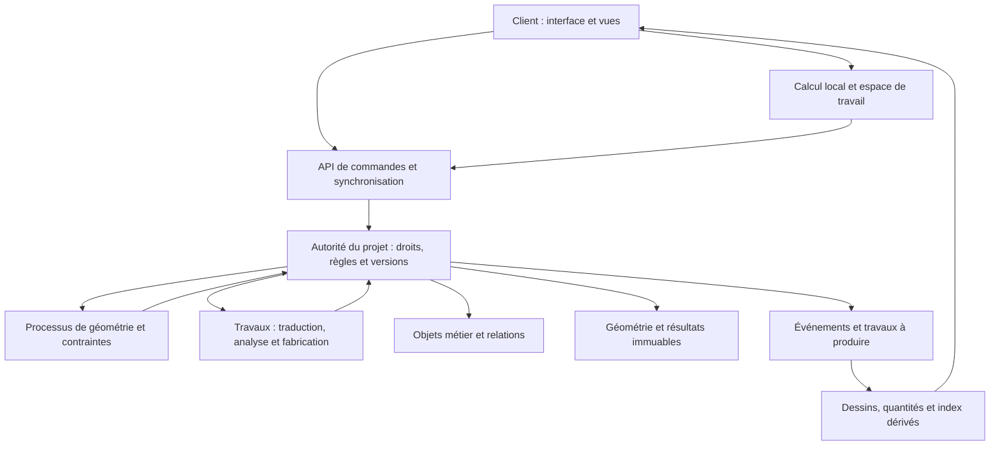

# DrawAll — Architecture de référence V4

**Version 4.0 — 3 octobre 2026**  
**Version 4.1 — base de développement.**
**Statut : architecture cible proposée, à éprouver par les prototypes P0 et P1. Les arbitrages techniques normatifs figurent en annexe D du document Exigences et sources (décisions D1–D6).**

Cette architecture organise la continuité des données entre bâtiment et industrie, la modularité du logiciel et la fiabilité des modifications. Elle distingue les contrats à respecter des composants techniques encore à sélectionner.

**Documents associés :** [Concept produit V4](DrawAll_v4.1_Concept.md) · [Exigences, applications de référence et sources V4](DrawAll_v4.1_Exigences_Sources.md).

## 1. Décisions structurantes

| Sujet | Décision de conception proposée | Ce qui reste à valider |
| --- | --- | --- |
| Produit | Une application et un projet pouvant réunir plusieurs disciplines | Ergonomie sur les parcours simples et mixtes. |
| Modularité | Paquets logiciels distincts, contrats explicites et responsabilités de données | Graphe réel des dépendances et tests de contrat. |
| Identités | Identifiants stables pour les objets, définitions, occurrences et représentations | Échanges, migrations et références après modification. |
| Géométrie | Plusieurs représentations adaptées ; autorité de calcul définie pour chaque partition cohérente | Noyaux, solveurs, précision et robustesse. |
| Licences des composants | OCCT sous **LGPL** : substitution technique possible (packaging modulaire) ou licence commerciale avant engagement produit | Arbitrage juridique et business à trancher avant P0. [S27] |
| Modifications | Commandes typées et validation transactionnelle | Concurrence, annulation et reprise. |
| Collaboration | Traitement selon nature des données et dépendances | Protocoles de synchronisation et résolution des conflits. |
| Stockage | Séparer données métier, volumes immuables et éléments dérivés | Performances, restauration, coûts et exploitation. |
| Ouverture | Contrats d’échange publiés et paquet natif documenté | Formats, versions, objets et dépendances réellement couverts. |

Le périmètre des moteurs et SDK n’est pas déduit de leur nom commercial. Les exemples OCCT, Onshape et autres sources éclairent des mécanismes précis, sans établir la performance future de DrawAll. [S01–S07]

## 2. Architecture logique et exécution

Quatre ensembles d’exécution structurent le système : client interactif, accès et synchronisation, services de projet et de calcul, puis stockage et données dérivées. Les 17 modules métier se répartissent dans ces ensembles selon leurs besoins.

Le client privilégie le retour immédiat et les calculs compatibles avec ses ressources. Le serveur fait autorité pour les modifications partagées. Une opération peut disposer d’un aperçu local puis d’une validation serveur ; la différence entre aperçu et résultat validé reste visible.

Les calculs géométriques, importateurs et travaux lourds sont isolés dans des processus pouvant être interrompus ou redémarrés. Une erreur de traduction ne doit pas corrompre le projet. Les travaux longs utilisent une révision d’entrée explicite et produisent des résultats rattachés à cette révision.

Le déploiement peut regrouper plusieurs modules métier dans un service applicatif, tout en isolant les calculs lourds. L’indépendance du code est imposée par les contrats ; le nombre de services déployés évolue selon les mesures de charge, de fiabilité et les besoins d’exploitation. Une édition produit unique ne signifie pas un bloc de code indifférencié.

## 3. Contrats de modularité

Chaque module M01–M17 est un paquet identifié, avec interface publique, types, migrations, permissions, événements et tests propres. Un manifeste indique ses versions compatibles et dépendances autorisées. Les interfaces doivent rester utilisables sans importer des détails internes d’un autre module.

| Contrat | Règle à vérifier |
| --- | --- |
| Commandes | Paramètres typés, unités, préconditions, effets attendus et résultat explicite. |
| Données | Propriétaire métier identifié pour chaque schéma ; accès externe par interface autorisée. |
| Dépendances | Pas de dépendance circulaire entre paquets ; coordination assurée par un orchestrateur lorsque nécessaire. |
| Interface utilisateur | Commandes enregistrées dans la palette et l’inspecteur avec aide, raccourcis et conditions d’activation. |
| Événements | Schémas versionnés, ordre défini là où nécessaire et traitement idempotent. |
| Migration | Transformation des données testée sur des projets représentatifs avant déploiement. |
| Extensions | Permissions et budgets de ressources déclarés ; aucune mutation directe hors transaction. |

Les règles de métier appartiennent aux modules concernés. Le socle commun porte identités, unités, transactions, versions, droits et contrats de représentation. Un module électrique n’accède pas librement aux tables internes du bâtiment : il utilise les interfaces d’implantation, d’objet ou de port nécessaires.

Un changement transversal est coordonné comme une opération explicitement décrite. Les modules évaluent leurs conséquences sur le même instantané ; l’autorité du projet valide l’ensemble applicable. Les modifications qui exigent une décision humaine restent des propositions liées à l’opération initiale.

## 4. Modèle d’information commun

Le modèle combine identités, géométrie, conception paramétrique, propriétés métier et relations. Ces dimensions ne sont pas interchangeables. La structure de données peut être relationnelle avec des tables de relations ; le terme graphe n’impose pas une base graphe.

| Entité | Rôle | Distinction essentielle |
| --- | --- | --- |
| Projet et espace de travail | Référentiels, participants, branches et configuration | Le projet n’est pas limité à une discipline. |
| Définition | Type de composant ou objet réutilisable | Une définition peut avoir plusieurs occurrences. |
| Occurrence | Utilisation placée et identifiée | Son placement n’altère pas la définition partagée. |
| Représentation | Forme ou description adaptée à un usage | BRep, symbole, maillage ou géométrie simplifiée peuvent coexister. |
| Propriété typée | Quantité, matière, classe ou référence | Valeur, unité, provenance et statut sont explicites. |
| Relation | Contient, héberge, assemble, connecte, contraint ou dérive | La relation porte un sens métier et ses conditions de validité. |
| Port | Interface de connexion | Le type et les règles d’un port limitent les connexions admises. |
| Fonction de conception | Opération et dépendances paramétriques | Présente lorsqu’un historique est connu ou créé, sans être inventée à l’import. |
| Document dérivé | Vue, feuille, annotation ou nomenclature | Références aux objets et révisions de calcul. |
| Résultat | Analyse, traduction ou préparation | Hypothèses, entrées, moteur et version enregistrés. |
| Publication | Ensemble approuvé et cohérent | Révisions et dépendances figées pour ce dossier. |

Les schémas métier décrivent types, propriétés et relations : architecture, structure, mécanique, électricité, électronique, procédés et extensions d’entreprise. Ils peuvent fournir plusieurs classifications à un même objet sans confondre ses représentations. Ils s'organisent en ontologies activables par projet — le bâtiment et l'industriel étant deux lectures d'un même modèle (Concept §1) :

| Ontologie | Objets métier fournis |
| --- | --- |
| building.architecture | murs, portes, fenêtres, dalles, toitures, escaliers, pièces, zones |
| building.structure | poteaux, poutres, treillis, armatures, ferraillage, préfabriqué |
| building.mep | réseaux, appareils, câbles, P&ID |
| building.timber | éléments bois/CLT, liaisons bois, débit |
| industry.mechanical | pièces, assemblages, tôlerie, soudures, tolérances géométriques |
| industry.electrical | symboles, borniers, câbles, automates, chemins de câbles |
| industry.plant | tuyauteries pilotées par spécifications, isométriques, supports |
| custom.* | ontologies créées par l'entreprise (schéma + propriétés + règles), sans code |

Les correspondances IFC ou STEP sont des adaptateurs versionnés. Les identifiants natifs, classifications externes et références de catalogue sont conservés séparément. Une propriété inconnue est signalée comme telle ; un import ne lui attribue pas arbitrairement une valeur métier.

## 5. Géométrie et précision

### 5.1 Représentations adaptées

La BRep conserve topologie et géométrie des objets techniques qui en ont besoin, avec surfaces analytiques ou paramétriques selon le cas. Les esquisses, SubD, maillages et nuages de points disposent de représentations adaptées. Les schémas utilisent également des objets symboliques et des réseaux logiques.

Les maillages d’affichage sont dérivés lorsque la représentation faisant autorité est une géométrie CAO. Un relevé peut au contraire avoir un nuage de points comme donnée source. Chaque représentation déclare son autorité, sa provenance et les règles de transformation.

La précision est exprimée par tolérances et critères d’opération. Le terme géométrie exacte distingue la représentation CAO de sa tessellation d’affichage ; il ne supprime pas les limites numériques des calculs.

### 5.2 Références topologiques

Les objets ont une identité stable, tandis que leurs faces et arêtes peuvent apparaître, disparaître ou se scinder. Le moteur enregistre la filiation des opérations et l’évolution de la topologie. Les références utilisent ces informations et leurs critères géométriques ou métier.

Si une cote ou une contrainte ne peut plus être rattachée de manière certaine, elle prend l’état « référence à réparer ». Le système présente les éléments concernés et les correspondances proposées. Il ne déplace pas silencieusement la référence vers une face voisine. Les mécanismes OCAF et les recherches dédiées au nommage topologique constituent des références à tester. [S04, S23]

### 5.3 Unités, coordonnées et recalcul

Les grandeurs sont typées, avec unités explicites. Les unités d’affichage n’altèrent pas la dimension physique des valeurs. Les tolérances d’un détail de fabrication et celles d’un contexte de site sont définies selon leurs besoins.

Le référentiel géospatial et les coordonnées locales du modèle sont reliés par des transformations explicites. Le rendu peut utiliser une origine proche de la zone visible, sans modifier l’implantation réelle des objets.

Les dépendances paramétriques sont évaluées dans un ordre maîtrisé. Les ensembles de contraintes simultanées sont résolus par les solveurs appropriés ; les cycles de dépendances non pris en charge sont signalés. Les calculs dérivés utilisent une clé incluant les entrées et versions de moteurs, afin de réutiliser uniquement des résultats compatibles.

## 6. Cycle transactionnel d’une commande

1. Le client transmet une intention : commande, version du contrat, paramètres, objets ciblés, identifiant de requête et révision de départ.
2. Le service vérifie autorisations, unités, types et préconditions.
3. Les modules et moteurs produisent un résultat provisoire sur un instantané cohérent.
4. Les contraintes, références et effets sur les dépendances sont évalués ; les conflits sont présentés.
5. Une transaction enregistre les changements métier et les références vers les volumes immuables validés.
6. Les événements associés et travaux dérivés sont enregistrés sans intervalle où une modification pourrait être validée sans sa notification nécessaire.
7. Les clients reçoivent l’état validé ; les vues et documents sont actualisés ou marqués à recalculer.

Les volumes immuables sont préparés avant d’être référencés par une transaction validée ; les volumes abandonnés sont récupérés ultérieurement selon une politique dédiée. La base métier et le stockage objet n’ont pas besoin d’être présentés comme une transaction physique unique.

Une requête répétée après interruption doit être reconnue pour éviter une double modification. Une réponse de calcul devenue ancienne est conservée comme résultat de sa révision, puis revalidée ou recalculée avant utilisation dans un état récent.

## 7. Collaboration et historique

| Cas | Contrat de comportement |
| --- | --- |
| Objets indépendants | Validation concurrente si les préconditions et dépendances restent compatibles. |
| Même paramètre ou fonction | Conflit explicite, réservation limitée ou branche selon la commande. |
| Texte partagé | CRDT envisageable pour un périmètre précisément défini ; bibliothèques éprouvées (Yjs ou Automerge) à évaluer. [S34] |
| Géométrie et contraintes | Fusion des intentions lorsque valide ; recalcul et contrôles obligatoires. |
| Objet supprimé pendant une autre édition | Aucune réapparition ou réaffectation implicite ; conflit à traiter. |
| Annulation | Inversion lorsque possible, sinon proposition de restauration ou nouvelle modification contrôlée. |
| Publication | Ensemble figé et validé ; les travaux ultérieurs restent distincts. |

La convergence des données ne garantit pas la validité métier. L’usage éventuel de CRDT doit préciser les données concernées et les invariants maintenus ; il ne vaut pas promesse de fusion universelle des modèles CAO. [S17] Des travaux académiques étudient l'extension des CRDT aux modèles CAO feature-based ; ils restent au stade de prototypes et relèvent de la veille technologique. [S35]

L’historique conserve commandes validées, instantanés, versions nommées et publications selon des règles documentées. Il permet une comparaison de géométrie, propriétés et documents, accompagnée de motifs de changement. Ni sa durée ni sa capacité ne sont annoncées comme infinies.

## 8. Travail local et continuité de service

L’utilisateur peut préparer un périmètre local comprenant objets, références, catalogues nécessaires et opérations compatibles. L’interface affiche les éléments réellement disponibles et l’état des modifications en attente.

Au retour du réseau, les commandes sont examinées selon les droits actuels, versions et règles du projet. Les opérations incompatibles restent des brouillons à traiter ; elles ne sont pas déclarées synchronisées.

Le stockage navigateur est soumis à des quotas et à des possibilités d’éviction. [S15] Le produit prévoit une surveillance de l’espace, une information sur l’état de synchronisation et des procédures de récupération. Les sauvegardes serveur et le paquet d’export demeurent distincts du cache.

Les transferts, accès serveur et données au repos doivent être protégés selon un modèle de sécurité documenté. Si le chiffrement local est retenu, les clés, la récupération et les effets de la déconnexion sont spécifiés avant de présenter la fonction comme disponible.

## 9. Données et stockage

| Donnée | Candidat de stockage | Règle d’autorité |
| --- | --- | --- |
| Identités, propriétés, relations et révisions | PostgreSQL, colonnes et tables typées ; JSONB validé pour les extensions | Données métier validées et contraintes d’intégrité. |
| Géométrie, scans, images et résultats volumineux | Stockage objet immuable et contrôles d’intégrité | Références identifiées depuis les révisions métier. |
| Recherche et navigation | Index et caches dérivés | Reconstructibles ; ne remplacent pas les données métier. |
| Événements et travaux | File de travaux et outbox transactionnelle | Traitement idempotent, progression et reprise explicites. |
| Travail navigateur | IndexedDB et/ou OPFS | Cache et commandes locales, avec état de synchronisation. |

Les catalogues et bibliothèques sont versionnés. Une publication enregistre les versions utilisées pour empêcher un remplacement silencieux par une définition plus récente.

Les sauvegardes couvrent métadonnées et volumes référencés dans un ensemble restaurable. Des essais de restauration vérifient que les références, permissions et publications restent cohérentes. Les journaux opérationnels mesurent les erreurs et durées sans devenir une copie non contrôlée des données confidentielles des projets.

## 10. Moteurs et échanges

| Composant | Option à évaluer | Critère de choix |
| --- | --- | --- |
| Géométrie CAO | OCCT comme référence de prototype — dont la distribution WASM récente (~4,5 MB brotli, API TypeScript, travailleurs web [S27]) — et alternative commerciale telle que Parasolid. **Vigilance : OCCT est sous licence LGPL** (voir §1). | Corpus, robustesse, précision, licences, mémoire et déploiement. [S03, S07] |
| Contraintes | Solveurs 2D/3D, dont D-Cubed parmi les références | Diagnostics, solutions, exactitude et intégration. [S06] |
| Rendu | **WebGL2 comme backend par défaut** ; WebGPU activable pour les scènes massivement instanciées et les compute shaders, avec repli automatique [S14, S28] | Capacités réelles, pertes de contexte et performances ; un signalement three.js (chute de 60 à 15 FPS sur 20 000 objets non instanciés, système UBO) justifie le WebGL2 par défaut pour les scènes BIM ; à reproduire sur le corpus DrawAll. [S28] |
| Calcul navigateur | Travailleurs web et WebAssembly si pertinent | Taille de chargement, mémoire, latence et compatibilité des résultats. [S05, S16] |
| BIM | Adaptateurs IFC ; IfcOpenShell parmi les bibliothèques | Types, unités, placements, propriétés et réexport. [S08, S12] |
| DWG/DGN | SDK spécialisé, dont ODA | Objets métier, versions, licences et fidélité. [S13] |
| Analyse et fabrication | Moteurs spécialisés derrière des adaptateurs | Hypothèses, résultats de référence et sorties couvertes. |

Un moteur, sa version et ses paramètres sont identifiés pour chaque opération faisant autorité. Un calcul local n’est accepté comme résultat partagé que selon une politique de validation définie. Plusieurs moteurs ne modifient pas concurremment le même solide sans arbitrage.

La matrice d’échange distingue lecture, édition, réexport et fidélité. Elle vérifie séparément géométrie, propriétés, assemblages, annotations, unités et références. Les formats IFC, STEP, BCF et IDS ont des rôles différents ; IDS ne remplace pas les contrôles géométriques. [S08–S11] La cible IFC est le schéma 4.3 (ISO 16739-1:2024) avec validation en continu ; le programme de certification actuel étant un scorecard fondé sur des fichiers soumis, l'engagement est une conformité testée, non une « certification produit ». [S32] Pour STEP, la cible initiale est AP242 Éd.3 (PMI sémantique), l'Éd.4 (PMI d'assemblage, cinématique) entrant en feuille de route. [S33] L'approche objets-en-flux des plateformes ouvertes inspire les connecteurs d'interopérabilité. [S31]

Le paquet natif contient un manifeste versionné, les références nécessaires, unités, référentiels, identités, schémas et données autorisées à l’export. Son ouverture dans le temps requiert une politique de migration documentée.

## 11. Analyse, fabrication et automatisation

Un calcul enregistre matériau, charges, conditions aux limites, idéalisation, solveur et hypothèses. La validité est évaluée sur des cas de référence et critères adaptés à la discipline. Un résultat visuel plausible ne constitue pas une validation.

La fabrication enregistre matière, paramètres de transformation, machine, outils et postprocesseur. Les développés, parcours et programmes sont liés à une révision de conception. Les sorties couvertes sont contrôlées avant publication.

L’électricité et l’électronique distinguent connectivité logique, implantation physique et documentation. Les ports, réseaux et repères sont liés aux mêmes identités de composants. La vérification des règles de carte ou d’armoire ne se réduit pas au contrôle des collisions. [S24]

L’automatisation utilise les mêmes contrats que les commandes interactives. Les bibliothèques de script sont versionnées ; exécution, permissions et quotas sont contrôlés. Un assistant IA à **boucle contrôlée** est proposé : génération d'une séquence d'opérations inspectable → validation par les moteurs déterministes → aperçu → exécution après accord explicite, avec auto-correction bornée (trois itérations maximum), journal des hypothèses et cache des opérations validées. Cette architecture s'appuie sur des résultats publiés récents — 95,71 % de succès pour un assistant multimodal avec cache de macros > 85× plus rapides [S29] ; autocontrainte d'esquisse en zéro-shot avec un F1 de 0,979, code vérifié par les moteurs [S30]. Ces résultats, obtenus en environnement mécanique, ne préjugent pas du transfert au bâtiment et aux réseaux — objet explicite de P0. Les capacités de génération étudiées par Text2CAD ne sont pas extrapolées à une validation professionnelle autonome. [S21]

## 12. Validation et prochaines décisions

Le prototype P0 doit comparer les moteurs sur des géométries difficiles, tester les références topologiques, l’import, les contraintes, la mémoire et l’interaction. P1 doit ensuite vérifier le parcours mixte et les états après interruption ou conflit.

| Essai | Résultat attendu |
| --- | --- |
| Modification de topologie | Références conservées correctement ou signalées à réparer. |
| Requête répétée | Une seule modification validée. |
| Deux modifications incompatibles | Conflit explicite, état partagé cohérent. |
| Calcul ancien terminé tardivement | Résultat rattaché à son entrée, sans écraser l’état récent. |
| Export et réimport | Écarts et pertes identifiés par le contrat d’échange. |
| Interruption réseau | États locaux visibles et reprise contrôlée. |
| Publication | Toutes les dépendances référencent les bonnes versions. |
| Restauration | Projet exploitable, objets et volumes associés intègres. |
| Navigation et édition | Budgets déclarés respectés sur les matériels et corpus fixés. |
| Apprentissage | Tâches, assistance nécessaire et rétention mesurées. |

Les décisions ouvertes sont le choix des noyaux, solveurs et traducteurs, le périmètre hors connexion, les règles précises de fusion et le niveau de prise en charge de chaque métier. Elles seront tranchées par les prototypes et documentées, sans transformer un candidat technique en capacité acquise.

## Références

Les sources S01–S35 et les mécanismes documentés des 32 applications sont conservés dans [Exigences et sources V4](DrawAll_v4.1_Exigences_Sources.md). Les concepts de BRep sont également explicités dans la [documentation du format OCCT](https://github.com/Open-Cascade-SAS/OCCT/wiki/brep_format), ressource historique dont le dépôt signale la migration vers la documentation officielle actuelle. [S26]
